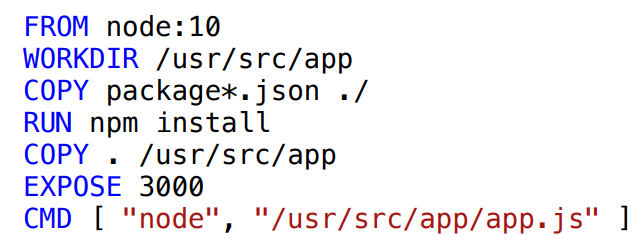

# Docker and Docker-Compose Explanation

Docker is a container-holding software technology that maintains an additional layer of abstraction and automation of operating system level update on Windows and Linux.
With container quality you can boot the applications faster, because it doesn't have OS to start, manager the portability easier and so on.

  

Before to start the tutorial, there's another thing so important to learn, the basic concepts from Docker:

* **Images:** A base to run an application. It contains all the necessary things to do that.
* **Container:** Image running.
* **Volumes:** Data storage area of the container.
* **Registry:** Save and manager docker images.
* **Network**: It's a network that connect the containers.
* **Docker Hub:** Public registry of docker images.
* **Dockerfile:** File with docker configurations from an image

To install this software, goes to the official [page](https://docs.docker.com/) and dowload it.

## Managing images/containers:

showing the images: `$ docker images`
showing the running images (containers): `$ docker ps` or `$ docker ps -a`
run an image: `$ docker run <name_of_image>:tag`, *tag* is used to choose a version of the image.

> Obs.:  if there is no image on your PC, the docker will try to import that image from Docker Hub

## Creating a new image and running it

The first step is to make a Dockerfile describing your new application. See the example below:

  

So, you can use the following command to create an new image:
`$ docker build <name_of_image>:tag`

And the last thing you have to do is run the image to create a container:
`$ docker run -p <local_port>:<container_port> -d <name_of_image>:tag`
* **-p:** map your local port to internal one from container
* **-d:** run image in background
* **local_port:** port from your computer, like 8080, for example
* **container_port:** port exposed by container

## Mapping a local path in a Docker path

This mapping is used to share *files* between your machine and a container. To use it, you need to add a ***-v*** into ***run command*** , as bellow:

example: `$ docker run -d -p 8080:3000 -v /tmp/data-log/:/tmp/ name_of_container`

Realize that *-v* is mapping the local path (/tmp/data-log/) into container path (/tmp/)

## Entering the command line of a container

You can also enter at command line from your created container and write your wished commands there. To do it, you have to use the following command:

`$ docker exec -it <name_of_container> <command>`, where  * **-i** * means interactive and ***-t***  is used to allocate a pseudo-tty. 

example: `$ docker exec -it nosql_mongo_name bash`

## Other important commands from Docker

Starting an existing container (| means 'or' logic): 
`$ docker start <id_of_container> | <name_of_container>`

Stopping a running container (| means 'or' logic): 
`$ docker stop <id_of_container> | <name_of_container>`

Remove a container (| means 'or' logic): 
`$ docker rm <id_of_container> | <name_of_container>`

Remove an existing image: 
`$ docker rmi <image_id>:<tag>`

> Obs.: it's so important remember that if you want to remove a container, you need before to stop it. Case you don't want to do that, add a new option (**-f**) after *docker rm* command. 

## Working with volumes
Volumes are a great mechanism for persisting data generated by and used by Docker containers. These have a lot of good features, between them are:
* Volumes are easy to bach up or migrate
* You can manage them using Docker CLI commands.
* They work on both Linux and Windows containers.
...

Create a volume: `$ docker volume create <volume_name>`
List all volumes existente: `$ docker volume ls`
Inspect a specific volume: `$ docker volume inspect <volume_name>`
Remove a volume: `$ docker volume rm <volume_name>`

In addition, you can use a container with a volume. To do that, use the ***-v*** parameter into the ***run command***.

`$ docker run -d --name <container_name> -v <volume_name | system_path>:<path_of_container> <name_of_image>`

As you can see from the command above, you can use a volume or system path to persist your data.

If you liked it and you want to see more about this topic, [click here](https://docs.docker.com/storage/volumes/ "click here").

## Using Docker Compose
Compose is a tool for defining and running multi-container Docker applications. With Compose, you use a YAML file to configure your application's services. Then, with a single command, you create and start all the services from your configuration.

Using Compose is basically a three-step process:
* Define your app's environment with a **Dockerfile** so it can be reproduced anywhere.
* Define the services that make up your app in **docker-compose.yml** so they can be run together in an isolated environment.
* Run `$ docker-compose up` and Compose starts and runs your entire app.

To install the Docker Compose, use this tutorial: [click here](https://docs.docker.com/compose/install/)

Some steps to start your project with Docker Compose:
* **Step 1: **Create a Dockerfile:
In your project directory, create a file named **Dockerfile** and configure it to your project.
* **Step 2: **Define services in a Compose file: 
Create a file called **docker-compose.yml** in your project directory and configure it too.
* **Step: 3: **Build and run your application with Compose: 
To do it, only write the command `$ docker-compose up`. It will do all the necessary things to run your application. 
* **Step: 4: **Open your application in the browse, only.

The steps above are very simple, but if you can know more about it, [look here](https://docs.docker.com/compose/). 
